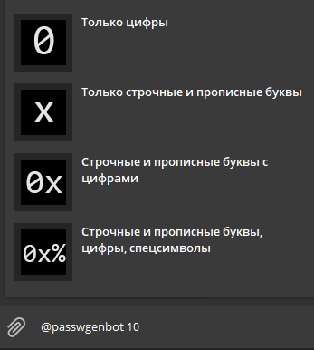

# 
 Password generator bot for Telegram #

[Read in russian](README_ru.md)

This bot allows you to generate passwords directly from Telegram.
This can be useful if you don't want open programs for managing or generating passwords.

[You can try it now: ** click **](https://t.me/passwgenbot)

### Features
* Inline mode.
* Generate passwords from prestes (/weak, /strong, ...).
* Customize generating passwords from settings.
* Supported English and russian language.

### Inline mode

### Generating from presets

### Settings

### Requirements
* Tested on python 3.7, 3.8
* [PyTelegramBotAPI](https://github.com/eternnoir/pyTelegramBotAPI) is very simple lib to create telegram bots.
* [TinyDB](https://tinydb.readthedocs.io/en/stable/) - document oriented database in file.

