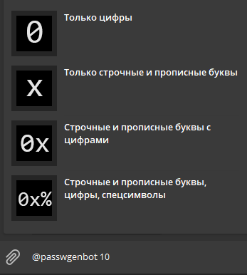
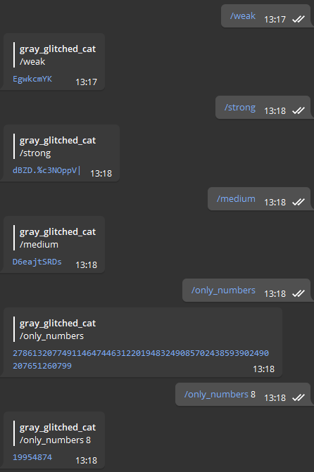
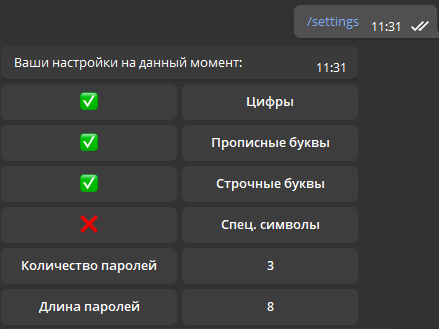

# 
 Бот "Генератор паролей" для Telegram #

Данный бот позволяет генерировать пароли прямо из Telegram.
Это может быть полезно, если вы не хотите открывать программы для генерации или управления паролями.

[Можете попробовать это прямо сейчас: ** click **](https://t.me/passwgenbot)

### Features
* Инлаин режим.
* Генерация паролей из пресетов (/weak, /strong, ...).
* Генерация паролей из настроек.
* Поддерживается русский и английский язык.

### Инлаин режим

### Генерация из пресета

### Настройки

### Требования
* Протестировано на python 3.7, 3.8
* [PyTelegramBotAPI](https://github.com/eternnoir/pyTelegramBotAPI) легкая библиотека для создания ботов.
* [TinyDB](https://tinydb.readthedocs.io/en/stable/) - документ-ориентированная БД в файле.

